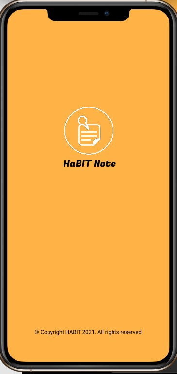
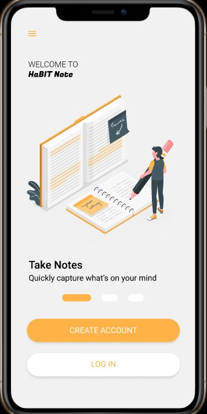
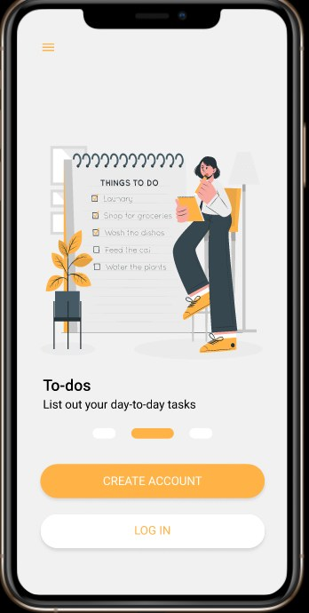
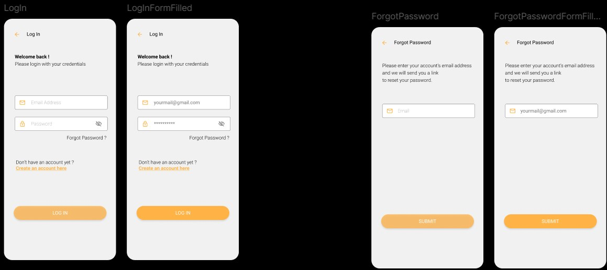
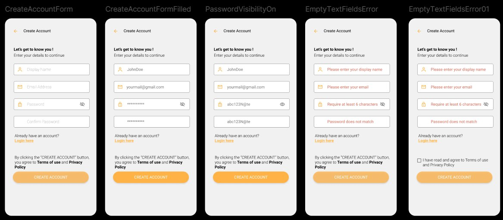
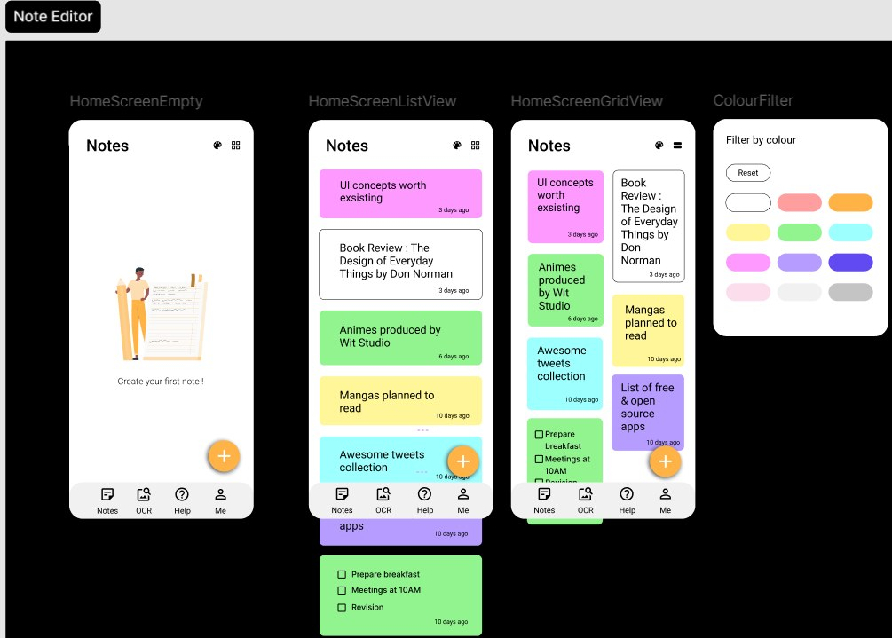
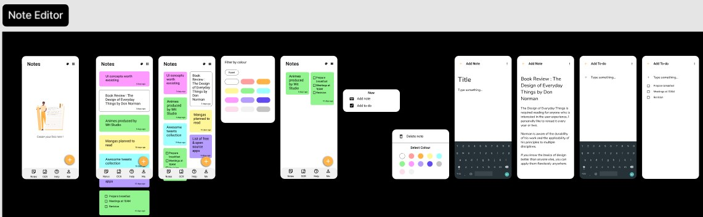
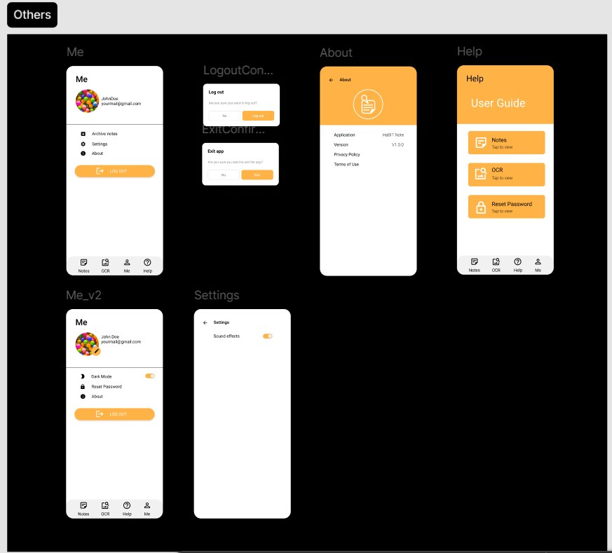

# 📝 HaBIT Note Flutter App

HaBIT Note is a Flutter-based mobile productivity application designed for creating notes, managing simple to-do tasks, and exploring a clean mobile user experience.

The project was developed as part of a Mobile Application Development course and focuses on Flutter UI design, navigation, form validation, onboarding flow, notes management, and basic app interaction patterns.

---

## 📌 Project Overview

HaBIT Note is a front-end focused mobile app prototype built with **Flutter** and **Dart**. It provides a polished note-taking interface with onboarding screens, authentication-style pages, a notes dashboard, note editor, color filtering, help pages, and user profile screens.

The current version focuses on UI/UX and local in-app state. It does not use Firebase or a permanent database yet, but it demonstrates the structure and flow of a real productivity application.

---

## ✨ Features

- Splash screen with app branding.
- Multi-screen onboarding flow.
- Login screen.
- Create account screen.
- Forgot password screen.
- Form validation screens.
- Password visibility toggle.
- Home notes dashboard.
- Empty notes state.
- Notes list view.
- Notes grid view.
- Color-based note filtering.
- Add note editor.
- Add to-do editor.
- Note color picker.
- Help/User Guide screen.
- About screen.
- Profile/Me screen.
- Settings and logout style screens.
- Bottom navigation bar.

---

## 🛠️ Tech Stack

| Category | Technology |
|---|---|
| Framework | Flutter |
| Language | Dart |
| UI Toolkit | Material Design |
| App Type | Mobile Application Prototype |
| State Handling | Stateful Widgets |
| Assets | Local image assets |
| Supported Platforms | Android / iOS compatible Flutter project |

---

## 📁 Project Structure

```text
HaBIT-Note-Flutter-App/
│
├── lib/
│   ├── main.dart
│   ├── splash_screen.dart
│   ├── home_screen.dart
│   ├── onboarding/
│   ├── screens/
│   └── tabs/
│
├── assets/
│   └── images/
│
├── screenshots/
│   ├── 01-splash-screen.jpg
│   ├── 02-onboarding-notes.jpg
│   ├── 03-onboarding-todos.jpg
│   ├── 04-authentication-flow.jpg
│   ├── 05-register-validation.jpg
│   ├── 06-notes-dashboard.jpg
│   ├── 07-note-editor-flow.jpg
│   └── 08-profile-help-about.jpg
│
├── pubspec.yaml
└── README.md
```

---

## 🖼️ App Screenshots

### Splash Screen



### Onboarding Screens

| Take Notes | To-dos |
|---|---|
|  |  |

### Authentication Flow



### Create Account and Validation



### Notes Dashboard



### Note Editor Flow



### Profile, Help and About Screens



---

## 🚀 How to Run Locally

### 1. Install Flutter

Make sure Flutter is installed on your laptop.

Check Flutter installation:

```bash
flutter --version
```

If Flutter is not installed, install it from the official Flutter website and set up Android Studio or VS Code with Flutter/Dart extensions.

---

### 2. Clone the Repository

```bash
git clone https://github.com/fayzliaqat/HaBIT-Note-Flutter-App.git
cd HaBIT-Note-Flutter-App
```

---

### 3. Get Project Dependencies

```bash
flutter pub get
```

---

### 4. Run the App

Connect a physical Android device or open an emulator, then run:

```bash
flutter run
```

---

## ▶️ Running in VS Code

1. Open the project folder in VS Code.
2. Install the Flutter and Dart extensions.
3. Run this command in the terminal:

```bash
flutter pub get
```

4. Select your device or emulator from the bottom-right device selector.
5. Press `F5` or run:

```bash
flutter run
```

---

## 📱 App Flow

```text
Splash Screen
      ↓
Onboarding Screens
      ↓
Create Account / Login / Forgot Password
      ↓
Home Notes Dashboard
      ↓
Notes / OCR / Help / Me Tabs
      ↓
Add Note / Add To-do / Filter by Colour
```

---

## 🧪 Main Modules

### 1. Splash and Onboarding

The app begins with a branded splash screen and then moves into onboarding screens that explain the main purpose of the application.

### 2. Authentication Screens

The project includes login, create account, forgot password, password visibility, and form validation UI screens.

### 3. Notes Dashboard

The dashboard displays notes in list and grid views. It also includes empty state design, color filtering, and note cards.

### 4. Note Editor

Users can create notes, write content, select colors, and create simple to-do style entries.

### 5. Help and Profile

The app includes a help/user guide section, about page, profile screen, settings style screen, and logout confirmation design.

---

## ✅ Concepts Demonstrated

- Flutter project structure
- Stateful widgets
- Navigation between screens
- Bottom navigation bar
- Form UI design
- Input validation UI
- Password visibility toggle
- Local state note handling
- Grid/list view layouts
- Color picker UI
- Custom onboarding screens
- Mobile UI prototyping

---

## ✅ Current Status

This is a working academic Flutter UI prototype. It is focused on front-end design and mobile app flow rather than backend integration.

---

## ⚠️ Current Limitations

- No Firebase authentication yet.
- Notes are not permanently saved after app restart.
- No cloud sync.
- No local database integration yet.
- OCR tab is currently part of the UI flow, not a complete backend OCR feature.
- Some screens are prototype-level and can be improved further.

---

## 🔮 Future Improvements

- Add Firebase Authentication.
- Add local storage using Hive, SQLite, or SharedPreferences.
- Add Firestore for cloud-based notes.
- Add full OCR/image-to-text functionality.
- Add search notes feature.
- Add reminders and notifications.
- Add dark mode persistence.
- Improve responsiveness for different screen sizes.
- Improve code structure by separating widgets and services.

---

## 👨‍💻 Author

**Fayz Liaqat**  
Artificial Intelligence Student  
